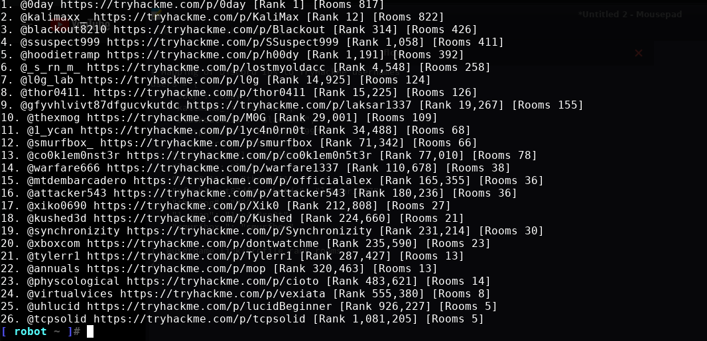

# 🛡️ TryHackMe Discord Update Leaderboard


## 📜 Description

Welcome to the **TryHackMe Discord Update Bot**! This script fetches the TryHackMe ranks and completed rooms for a list of users and posts the results to a Discord channel. It's perfect for keeping your community updated on their TryHackMe progress!

## 🌟 Features

- Fetches TryHackMe user ranks and completed rooms.
- Updates a Discord channel with the latest stats.
- Clears the terminal screen for a clean update display.
- Uses Python's `requests` module for API interactions.

## 📂 Project Structure

- `discupdate.py` - Main script to fetch data and post updates.

## 🚀 Getting Started

### Prerequisites

- Python 3.x
- TryHackMe usernames

### Installation

1. Clone the repository:

    ```bash
    git clone https://github.com/pentestfunctions/tryhackme_discord_update.git
    cd tryhackme_discord_update
    ```

### Configuration

1. Update the `users` dictionary with the Discord IDs and corresponding TryHackMe usernames:

    ```python
    users = {
        "discord_id_1": "tryhackme_username_1",
        "discord_id_2": "tryhackme_username_2",
        ...
    }
    ```

### Usage

Run the script to fetch TryHackMe data and update the Discord channel:

```bash
python discupdate.py
```

## 🛠️ Development

Feel free to contribute to this project! Here are some ways you can help:

- Reporting bugs
- Adding new features
- Improving documentation

### 📷 Screenshots



---

### 🙏 Acknowledgements

- Thanks to [TryHackMe](https://tryhackme.com) for their awesome platform.
